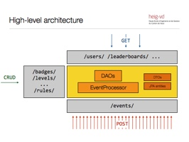
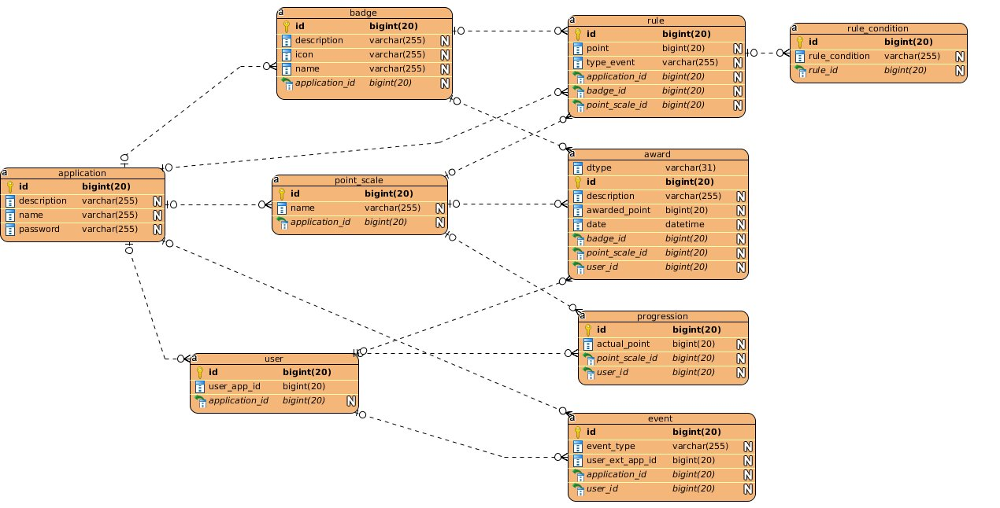

# AMT-Gamification-Platform 2016-2017


## Project description
The purpose of this project is to deploy a REST API using JAVA EE standards. We're using the SpringBoot framework. We're using a top-down approach, we're using Swagger editor to create a code skeleton.
After that we complete the automatic generated code manually.

The purpose of the application is to host a Gamification-Platform. This platform must be abéle to give to the user's of it the possibility to give reward (badges/points) to an user
of their website by triggering defined rules with event. All of this fonction are accesible via a REST API.

Our REST API allow you to execute all basic CRUD operations (Create, Read, Update, Delete).



## Technology used
* Java
* Springboot (FrameWork)
* SpringFox (Top-Down)
* Swagger (Documentation)
* MySQL (Database)
* Cumcumber (Automated tests)

## Database diagram


## Usefull links

You can access the automatically generated API REST documation by following this link when the application is running :
```
http://localhost:8090/api/swagger-ui.html
```

PHPmyAdmin is accessible via the next link if you are running the DB inside a docker container with windows :
```
http://192.168.99.100:6060/
```

Or via this link if you are running it locally :
```
http://localhost:6060/
```

The login are :
user : root
mot de passe : adminpw


## Deployement

To deploy the application you must start the docker container in the root directory of the application with the command :
```
docker-compose up --build
```

Next you must import the application project into netBean (or ecplise but it can be tricky to make it work).
After that you can clean and build the project and start it by doing a right click on the project and selecting "Custom -> spring-boot:run".


## Tests

To run the automated test, you have to first deploy the application (step Deployment above), then right click on the ExecutableSpecification project and choose Clean and Build. 
After that you right click again on the same project and this time choose Test.

This automated test, will simulate each available function of the endpoints.