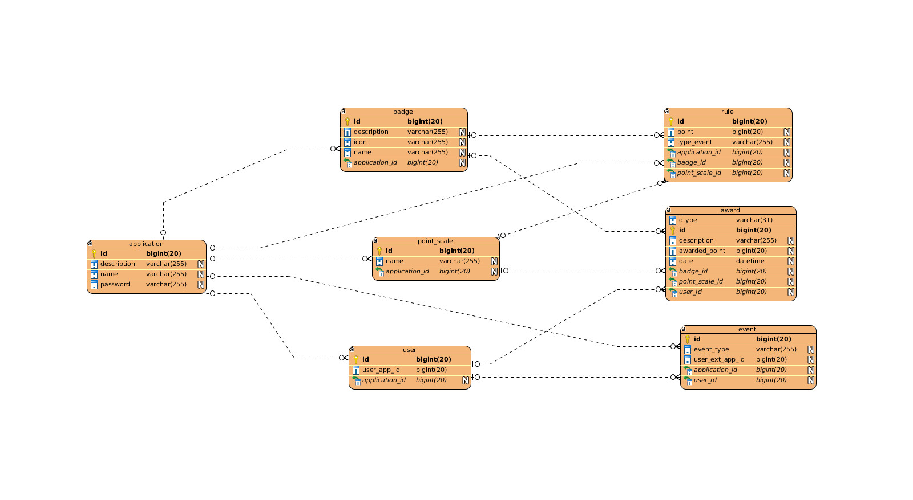

# AMT-Gamification-Platform 2016-2017


## Description du projet
Le but de ce projet est de déployer une API java respectant la spécification Java EE. Nous utilisons le framework Springboot comme base. Un squellette à été généré avec Swagger editor pour nous servire de point de départ.
Notre api REST permet d'effectuer les opérations du CRUD sur nos différent endpoints à l'exception de "events" qui ne permet que de faire des POST


## Technologies utilisées
* Java
* Springboot (FrameWork)
* SpringFox (Top-Down)
* Swagger (Documentation)
* MySQL (Base de donée)
* Cumcumber (Tests automatisés)

## Base de données


## Liens clés

Documentation de l'API avec ces endPoints (documentation générée dynamiquement avec SpringFox)
```
http://localhost:8090/api/swagger-ui.html
```

PHPmyAdmin
```
http://localhost:6060/
user : root
mot de passe : adminpw
```


## Deployement

Lancer le contenueur Docker qui contient la base de données
```
docker-compose up
```
Faire un clean and build dans l'ide, puis lancer l'application avec les goal. Dans netBean, faire clique droit sur le projet custom->springboot:run


##app demo
# AMT-Gamification-Platform 2016-2017


## Description du projet
Le but de ce projet est de déployer une API java respectant la spécification Java EE. Nous utilisons le framework Springboot comme base. Un squellette à été généré avec Swagger editor pour nous servire de point de départ.
Notre api REST permet d'effectuer les opérations du CRUD sur nos différent endpoints à l'exception de "events" qui ne permet que de faire des POST


## Technologies utilisées
* Java
* Springboot (FrameWork)
* SpringFox (Top-Down)
* Swagger (Documentation)
* MySQL (Base de donée)
* Cumcumber (Tests automatisés)

## Base de données


## Liens clés

Documentation de l'API avec ces endPoints (documentation générée dynamiquement avec SpringFox)
```
http://localhost:8090/api/swagger-ui.html
```

PHPmyAdmin
```
http://localhost:6060/
user : root
mot de passe : adminpw
```


## Deployement

Lancer le contenueur Docker qui contient la base de données
```
docker-compose up
```
Faire un clean and build dans l'ide, puis lancer l'application avec les goal. Dans netBean, faire clique droit sur le projet custom->springboot:run

## Application demo
https://github.com/cmtCousteau/AMT-2016-Discovery
